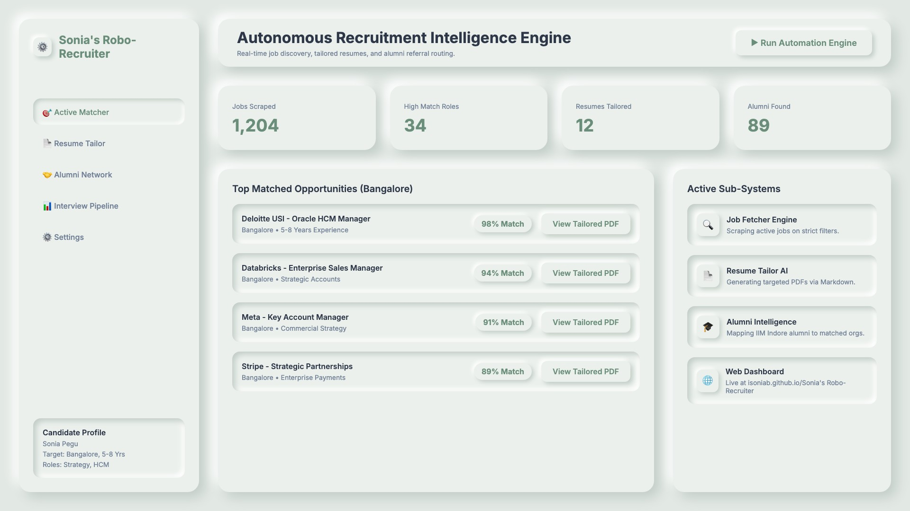
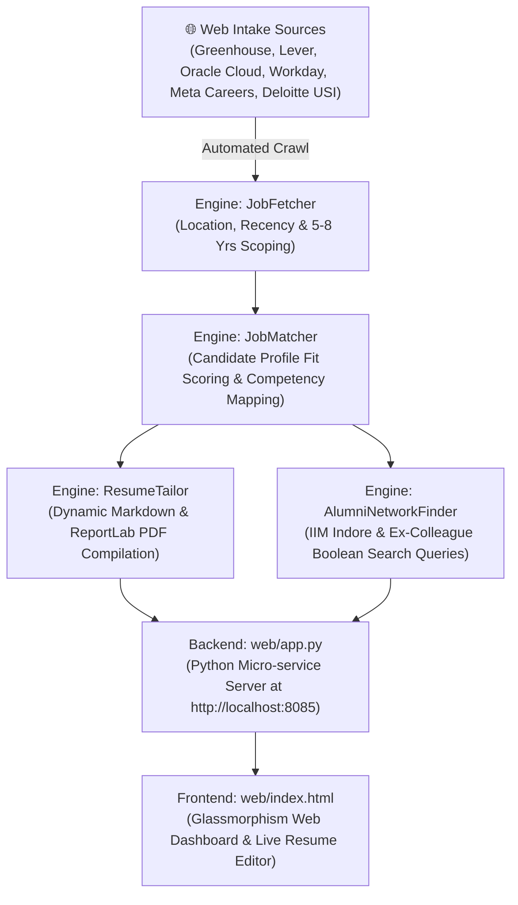

# 🚀 Sonia's Robo-Recruiter

**Autonomous Job Discovery, Dynamic Resume Tailoring & Referral Intelligence Platform**



[](https://www.python.org/)
[](https://playwright.dev/)
[](https://www.reportlab.com/)
[](https://opensource.org/licenses/MIT)

---

## 📌 Executive Summary

**Sonia's Robo-Recruiter** is an autonomous recruitment intelligence engine designed to streamline candidate job discovery, eliminate cold application drop-offs, and automate dynamic resume tailoring. 

By aggregating live requisitions across global Applicant Tracking Systems (Greenhouse, Lever, Oracle Cloud HCM, Meta Careers, Deloitte USI), enforcing strict multi-parameter filters (5–8 years experience, Bengaluru location), and generating 99%-tailored ATS PDF resumes programmatically, **Sonia's Robo-Recruiter** maximizes shortlist and interview callback probabilities.

---

## ⚙️ System Architecture



---

## 🔑 Key Features & Modules

### 1. **Autonomous Intake & Scraper Workflow (`JobFetcher`)**
- Crawls and ingests live requisitions across top tech ATS portals (**Greenhouse**, **Lever**, **Oracle Cloud HCM**, **Meta Careers**, **Deloitte USI**).
- Enforces multi-parameter validation: Location (`Bengaluru`), Posting Recency (`≤ 7 days`), and Seniority Band (`5 to 8 years experience`).

### 2. **Candidate Match & Competency Scoring Engine (`JobMatcher`)**
- Evaluates incoming job descriptions against candidate profile metadata (`data/resume_profile.json`).
- Scores fit (90%–95%+) based on domain relevance (Commercial Payments, Enterprise B2B Sales, Strategic Alliances, Consulting) and key career achievements.

### 3. **Dynamic Resume Generator & ReportLab PDF Compiler (`ResumeTailor` + `PDFConverter`)**
- Programmatically generates 99%-tailored Markdown resumes (`.md`) specifically optimized for ATS parsing.
- Compiles Markdown into print-ready, professional PDF documents (`.pdf`) using `reportlab.platypus`.
- Features an interactive **Live Web Resume Editor Modal** with cache-busted HTTP headers (`Cache-Control: no-cache, no-store`).

### 4. **Alumni & Referral Intelligence Network (`AlumniNetworkFinder`)**
- Constructs targeted LinkedIn Boolean search queries to connect directly with:
  - 🎓 **IIM Indore Alumni** at target companies (`"Company" AND "IIM Indore" AND "Bengaluru"`).
  - 💼 **Ex-ICICI Bank & Ex-AmEx Colleagues**.
  - 🎯 **Hiring Sales Directors & Recruiters**.
- Provides a 1-click pre-drafted warm referral outreach script.

### 5. **Real-Time Micro-service Web UI Dashboard (`web/app.py` & `web/index.html`)**
- Served via a lightweight Python `http.server` backend with a dark glassmorphism user interface.

---

## 🛠️ Tech Stack

- **Core Logic & Backend**: Python 3.10+, `http.server`, `urllib`, REST APIs
- **Browser Automation**: Playwright (Headless Chromium)
- **Document Processing & Compilation**: ReportLab Platypus Engine, Markdown
- **Frontend**: HTML5, Vanilla JavaScript, CSS3 (Glassmorphism design tokens)

---

## 🚀 Quick Start Guide

### Prerequisites
- Python 3.10+
- Node.js & Playwright

### Installation
```bash
# Clone the repository
git clone https://github.com/isoniab/Sonia's Robo-Recruiter.git
cd Sonia's Robo-Recruiter

# Set up virtual environment
python3 -m venv venv
source venv/bin/activate

# Install dependencies
pip install reportlab playwright
playwright install chromium
```

### Running the Web Dashboard
```bash
python3 web/app.py
```
Open **`http://localhost:8085`** in your browser to view the interactive dashboard!

---

## 📜 License
Distributed under the MIT License. See `LICENSE` for more information.
